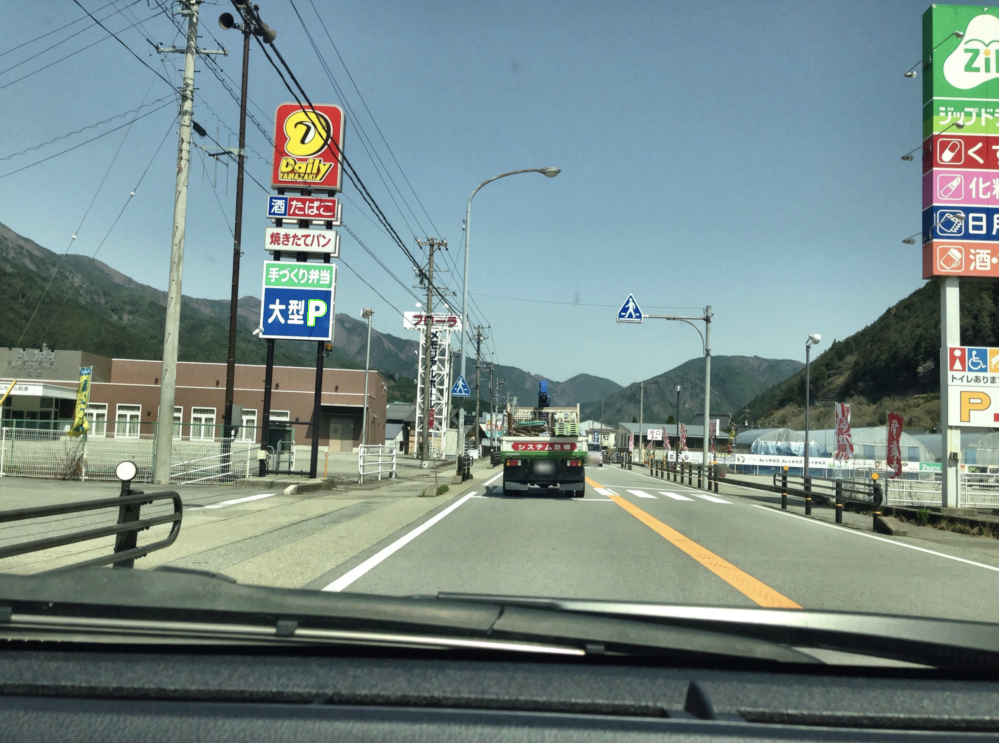
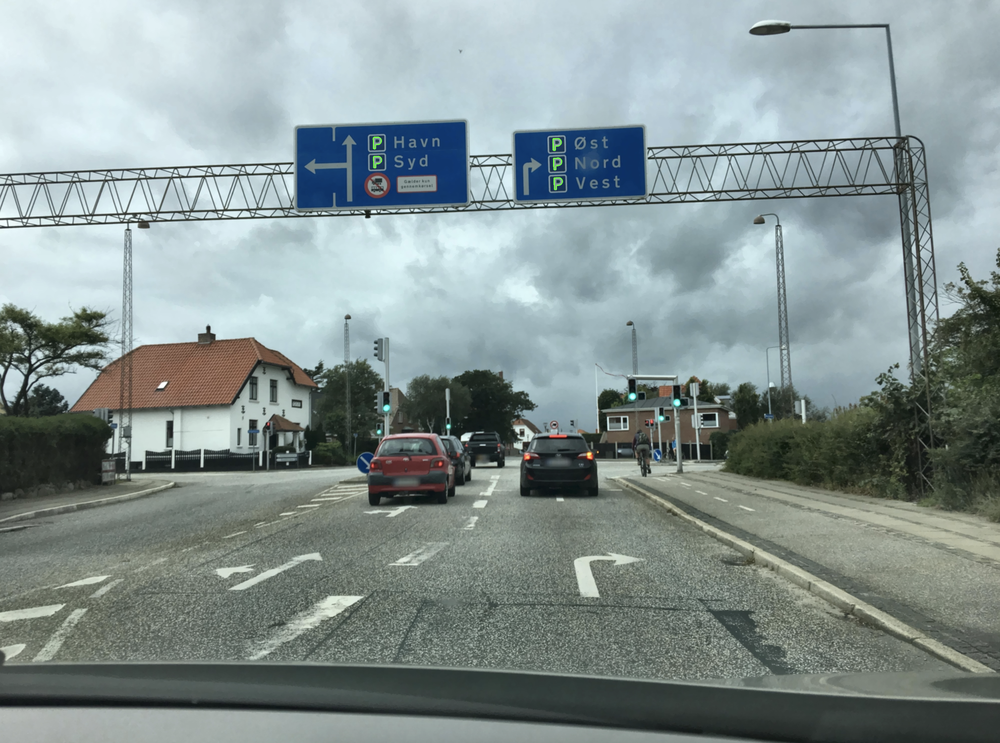
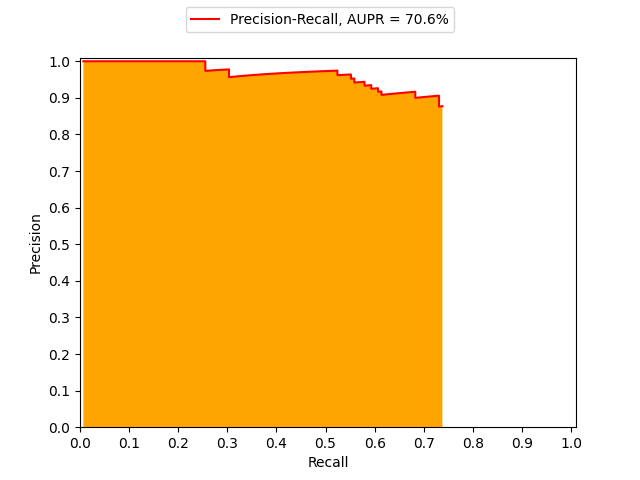

# Parking Sign recognition
Implementation of the recognition of the parking sign with Image Analysis techniques using C++ and OpenCV library on a subset of Mapillary dataset.

Example of detected signals with green contour:

 <br>
 <br>

# Requirements
- OpenCV for C++:
    - [Download for macOS](https://docs.opencv.org/3.4/d0/db2/tutorial_macos_install.html)
    - [Download for Linux](https://docs.opencv.org/3.4/d7/d9f/tutorial_linux_install.html)
    - [Download for Windows](https://docs.opencv.org/3.4/d3/d52/tutorial_windows_install.html)

# Dataset
The dataset is composed of 100 images, in .jpg format, annotated using .json files. The images were renamed sequentially from 0 to 99 to better manage them.

The images contain some parking signs that are occluded from another object or partially out of frame. The following analisys take this in account by choosing if these signals have to be considered or not.

|                 | WITH occluded and out of frame | WITHOUT occluded and out of frame |
|-----------------|--------------------------------|-----------------------------------|
| Number of signs |             160                |                145                |

Five image annotations were corrected by adding missing parking signs that were not labeled. These are the images number 21, 25, 57, 86, 93. Thus, if you download the original .json files from the web, they will miss some annotations compared to the one in this repository.

# File organization
The following repository is organized to be built using CMake.

- **3rdparty**: set of functions for image processing
- **cmake**: CMake compiling files
- **myproject**: contains the source code of the project
    - **config.h**: configuration file where the needed path variables have to be initialized in order to run the analisys.
    - **functions.h** and **functions.cpp**: contain the definitions and implementations of the criterion applied during the analisys.
    - **main.cpp**: starting point of the project where the dataset is loaded and the filtering criterion are applied.
    - **performance.py**: performance evaluation code in Python.
- **output**: contains some example images of the dataset with the detected contours.
- **preprocessing-data-analisys**: contains a folder with the infos about the two preprocessing applied in this analisys: **meanshift-5** and **meanshift-5-clahe-1**. Each folder contain:.
    - **histograms.rtf** the values analized for every sign in the dataset.
    - **log.rtf** show the log infos for each image
    - **no-occluded-out-of-frame** and **occluded-out-of-frame**: the **log.rtf** of the experiment, the **label-scores.csv** file with the score of every detection used to evaluate the **precision-recall.png**
- **subset-EIID-AIA-parking-enum.zip**: .zip file of the 100 subset images and their corresponding .json annotations choosen for this project.
- **template-set-P**: set of stretched parking sign used for the Match Shape criterion.

     <br>

# How to run it
Build the project using CMake ([Download link](https://cmake.org/download/)):

1. Clone the repository and select it as the source code directory.
2. Choose the destination folder where the built project will be stored.
3. Open CMake and click Configure.
4. Select the desired generator:
   - For Unix Makefiles: Choose **Unix Makefiles** and ensure **Use default native compilers** is selected.
   - For IDEs supported by CMake (e.g., Xcode, Visual Studio, Eclipse), select the appropriate generator and ensure **Use default native compilers** is selected.
5. If OpenCV is not found automatically:
   - Add the OpenCV paths manually by clicking the ellipsis button next to the error message.
   - Alternatively, update the `CMakeLists.txt` file to specify the paths of your OpenCV installation. For example:
     ```cmake
     # Example for OpenCV
     set(OpenCV_DIR "/path/to/opencv/build")
     ```
6. Click Generate.

    ### For Xcode Users
    1. Navigate to the destination folder and open the generated Xcode project.
    2. In Xcode, select the executable target from the top menu.
    3. Click the Play button in Xcode to build and run the project.

    Note:
    - You may need to include the following lines in the `CMakeLists.txt` file to specify the compiler paths:
        ```cmake
        set(CMAKE_C_COMPILER /Applications/Xcode.app/Contents/Developer/Toolchains/XcodeDefault.xctoolchain/usr/bin/cc)
        set(CMAKE_CXX_COMPILER /Applications/Xcode.app/Contents/Developer/Toolchains/XcodeDefault.xctoolchain/usr/bin/c++)
        ```

    - If you encounter errors, such as an unrecognized compiler during the Configure step, you can run the following command to set Xcode tools correctly:
        ```bash
        sudo xcode-select -s /Applications/Xcode.app/Contents/Developer
        ```

    ### For Unix Makefiles
    1. Navigate to the build folder using a terminal.
    2. Run the `make` command to compile the project:
        ```bash
        make
        ```
    3. After compiling, launch the application with:
        ```bash
        ./aia
        ```

7. Open the project folder and fill the *config.h* with your path variables. Define your identifier and define under it the necessary variables.

    Choose the corresponding path variables:

    - *ORIGINAL_DATASET*: the path to the original dataset folder *subset-EIID-AIA-parking-enum*.
    - *PREPROCESSED_DATASET*: the path to the desired preprocessed dataset to analize, that is the meanshift-5 or the meanshift-5 plus clahe-1.
    - *OUTPUT_DATASET*: the path containing the entire dataset with the identified contours.
    - *PREPROCESSING_FOLDER*: the path to the preprocessed dataset to extract, that is the meanshift-5 or the meanshift-5 plus clahe-1.
    - *PERFORMANCE_FOLDER*: the path where to save the *label-score.csv* together with the *performance.py* to obtain the AUPR curve.
    - *TEMPLATE_FOLDER*: the path to the *template-set-P* folder.

    Define your intial identifier:

    - *PREPROCESSING*: if specified, apply the mean shift 5 preprocessing and save the new dataset into the specified folder.
    - *SKIP_OCCLUDED_AND_OOF*: if specified, signs labeled as occluded or out of frame are not considered.
    - *USE_CLAHE*: if specified, the analisys will consider to apply clahe 1.

8. Run the *main.cpp* file to perform the analisys.

## Important Notes
- Ensure the `CMakeLists.txt` file is updated with the correct paths for the OpenCV library and other dependencies.
- Do not rename or move the source or destination folders after generating the project; otherwise, the build may fail.
- Avoid using folder names with special characters or spaces, as they may cause errors in the build process.
- If you encounter issues with compiler recognition during the Configure step, ensure you are using the correct toolchain or set it explicitly in the `CMakeLists.txt`.

Note: No matter which compiling solution you use, you can build the project using any IDE project created by CMake (e.g., Visual Studio, Eclipse, Xcode).


# Performance
The best performance is achived with the mean shift 5 plus clahe 1 on the dataset without the occluded and out of frame signs. The best AUPR is 70.6% with an accuracy of 73.79%.

 <br>
